# Love Link

## AI 恋爱模拟游戏：Sui 链上的心动之旅 🌸

**在 Sui 区块链上构建的下一代 AI 互动游戏**  
玩家通过与多个不同性格和背景的 AI 角色约会，解锁隐藏故事，收集独特 NFT，体验数字时代的浪漫关系

## ✨ 核心功能
- **多类型 AI 角色**  
  温柔学姐、傲娇偶像、神秘艺术家...每个角色拥有独立 Sui 钱包地址
- **动态好感度系统**  
  - 通过聊天提升好感度（自然语言处理 + 情感分析）
  - 赠送 NFT 礼物获得加成（Sui Move 智能合约）
- **链上里程碑奖励**  
  - 30%：解锁角色秘密日记（IPFS 加密存储）
  - 70%：获得约会邀请函（动态生成 NFT）
  - 100%：铸造永恒誓约 NFT（ERC-1155 标准）
- **去中心化存储**  
  角色记忆、对话记录、礼物数据和NFT的资源通过 Walrus 保存

## 🛠️ 技术架构

```mermaid
graph LR
    A[前端] --> B[React+TypeScript]
    A --> C[Phaser.js游戏引擎]
    B --> D[AI交互界面]
    C --> E[2D/3D场景渲染]
    
    F[后端] --> G[Node.js]
    G --> H[Eliza对话引擎]
    G --> I[DeepSeek情感分析]
    
    J[区块链] --> K[Sui Move合约]
    K --> L[NFT铸造系统]
    K --> M[好感度状态机]
    K --> N[交易事件监听]
    
    D --> J
    I --> J
```

